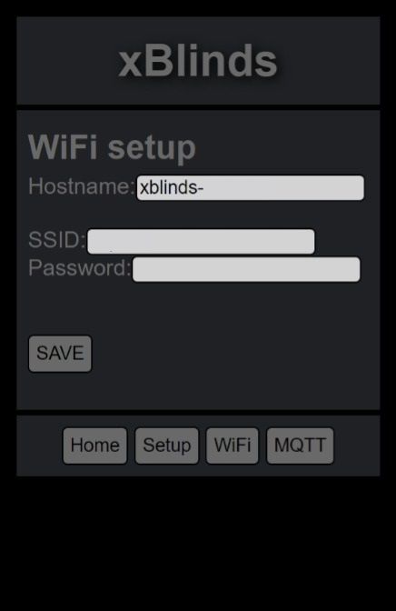
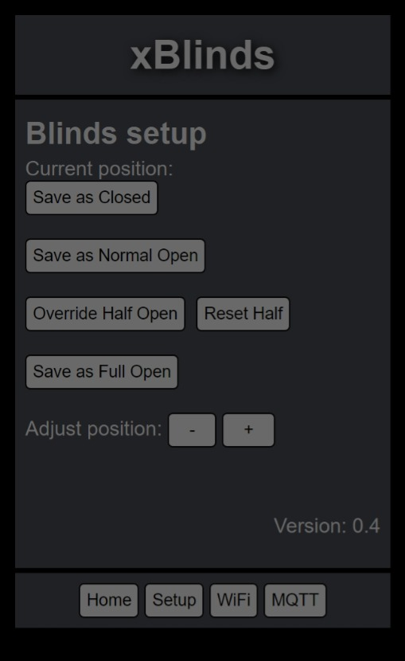
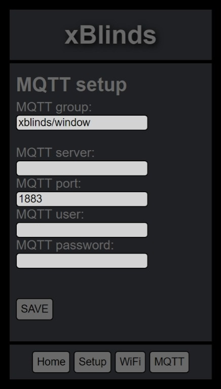
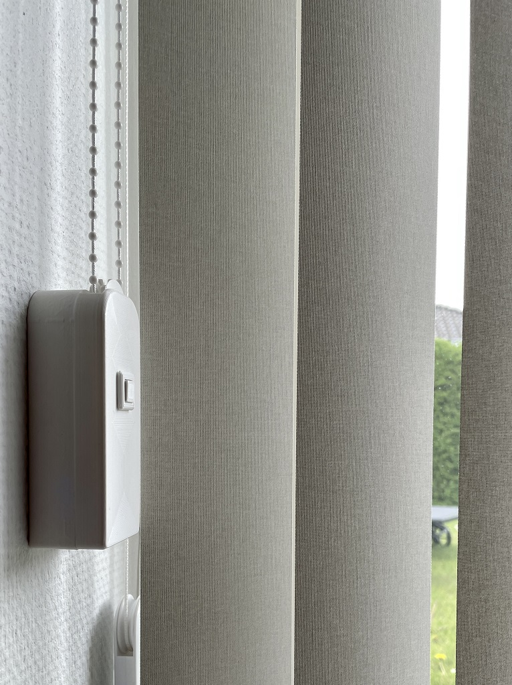
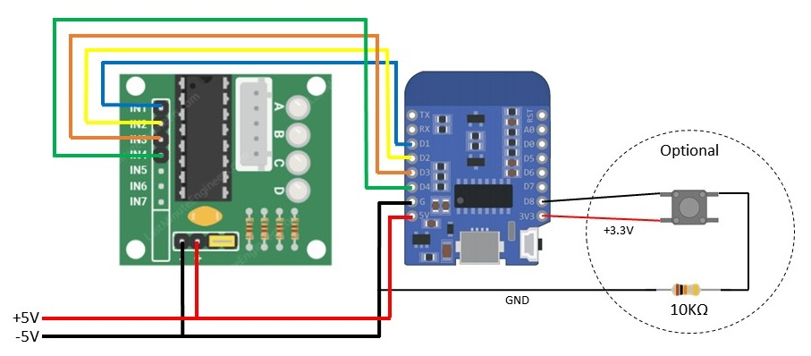

# xBlinds

The xBlinds project started because I wanted a (cheap) way to motorize my vertical blinds and existing commercial solutions are heavily priced and not getting the best reviews, so a wintery night I started sketching the UI in Notepad.

This project is two-fold; the bin and guide published here and the STL for the casing on Thingiverse https://www.thingiverse.com/thing:4792584.

2022.04.15:
xBlinds is now feature complete (for my use, at least) and I've released the v1.0 bin and source code - please find all releases and release notes in the right side of your browser.
There is important information among the release notes not documented in the README.md so make sure you read through them all!

## Quick Guide

The bin is compiled for ESP8266 and will run on most variants but most importantly on the D1 mini which will fit into the 3D-printed casing.

Use your favorite flasher to flash the ESP (plenty of guides available for that out there).

## Caution

> If your blinds aren't running smoothly you may damage the stepper or the blinds when trying to pull the beaded string. I had to lube the gears in one of my blinds with some WD-40 for it to run smooth enough for the stepper to pull it. You may want to print the pulley first and just try it with the stepper handheld, to avoid any damage.
> The stepper is configured for max torque using the FULL4WIRE mode of the AccelStepper library in combination with slow acceleration.

### Initial Setup

When powering up the ESP for the first time, it will show up as a WiFi AP with the SSID xblinds-abcdef (where "abcdef" are the last 6 digits of the MAC address), use the password "persienne" (Venetian blind in Danish) to log on to the SSID.

To access the web based setup, enter the address 4.3.2.1 which will take you to the main screen (described later).

In the bottom of the screen, press WiFi to open this screen:



Hostname can't be edited, it will always be xblinds-abcdef (defined by MAC address).

Input your home SSID and password and press save.

Once connected to your home WiFi, the ESP will no longer publish an AP so you need to find its new IP address in your router.

If at all possible, make sure the SSID you're using is 2.4GHz only, as the ESPs can show random errors and/or disconnects when using shared 2.4/5GHz SSIDs. This is also the case if you have channel interference from neighbors, etc.

### Adjusting the Blinds

I've put in some default stepper values in the code, they will most likely not fit your usage (or mine, for that matter), they are simply there to test that the stepper moves, when buttons are pressed.



My recommendation is to attach to the blinds when they're closed and then press "Save as Closed" when the beaded line is seated well and the vertical blinds are closed.

> Note!
> Pressing + will turn the pulley counter-clockwise. Be careful you don't overstretch the line and/or break the gears in the stepper or the blinds.

Adjust your blinds, pressing + and - and press "Save as Normal Open" or "Save as Full Open" when they are in the desired position. A "half" position is calculated behind the scenes. Allow a couple of seconds between each press.

If you want to save your own half position, v0.4 added the "Override Half Open" button to do just that and the "Reset Half" button to revert to the calculated position.

To be able to use tilt, which is introduced in v0.8, you need to at least define the "closed" and "full" presets, as they will be used as 0 and 100 percent open.

You can test your positions on the main screen:


The positions may need some tweaking after the strings have settled in. And you may need to adjust the positions after firmware updates.

### MQTT

My main objective with this project was to have Home Assistant take care of the blinds, instead of me fiddling with my phone to open and close them, which is why I added MQTT to the mix. If you have no need for MQTT, leave this page blank - you may see untested results, if you put in a non-existing server, just saying...




The default group is xblinds/all but you can name it whatever you want. I'm using xblinds/window for my three xblinds working together.

Input your MQTT server IP address. I'm using Mosquitto on Home Assistant, but I guess you could use CloudMQTT or a similar service, if you want.

Default MQTT port is 1883.

Lastly input a username and password for an account that has write access, as xblinds publishes a status.

If you experience unexpected open/closing of your blinds, you may have some lingering MQTT retained messages in the queue. I can recommend using MQTT Explorer (http://mqtt-explorer.com/) for troubleshooting and clearing of those messages.


### Home Assistant Yaml

Use this configuration to have your xBlinds using Home Assistant's "Cover" integration. See https://www.home-assistant.io/integrations/cover.mqtt/ and note that v0.8 has added support for "tilt". Note: Syntax has changed in Home Assistant 2022.7
```yaml
mqtt:
  cover:
    - name: "xBlinds Window"
      command_topic: "xblinds/window"
      state_topic: "xblinds/window/status"
      qos: 0
      retain: true
      payload_open: "open"
      payload_close: "close"
      state_open: "open"
      state_closed: "closed"
      optimistic: false
      tilt_command_topic: "xblinds/window/tilt"
      tilt_status_topic: "xblinds/window/tilt-state"
      tilt_optimistic: false
```


You can also use MQTT directly in your automations/scripts:

```yaml
scene_shades_open:
  alias: Shades Open
  sequence:
    - service: mqtt.publish
      data:
        topic: xblinds/window
        retain: true
        payload: open
```

Or address the tilt as presets, like this:

```yaml
scene_shades_open:
  alias: Shades Open 80%
  sequence:
    - service: mqtt.publish
      data:
        topic: xblinds/window/tilt
        retain: true
        payload: 80
```


The recognized payload keywords are:
- close
- open
- half
- full

The returned status messages are (changed in v0.7):
- closing
- closed
- opening
- open
- "hostname" is not connected
- Reconnected
- Rebooted

### OTA Update

I realized that updating the firmware would be a hassle, if you'd already mounted the unit somewhere more or less accessible, so version 0.4 added OTA support, just navigate to http://IP-address/update to upload and update to newer versions of the firmware.


### Toogle button

Version 0.5 adds support for a tactile button to toggle open/close directly on the xBlinds unit. It will require printing a new lid (available on Thingiverse) for the unit and it's completely optional.


### Thingiverse

If you want to 3D print this project, go to Thingiverse to download the STLs here: https://www.thingiverse.com/thing:4792584

Here's the xblinds unit assembled: (You can safely desolder the LED's on the ULN2003 stepper driver if you should want to).


And this is what it looks like mounted on the wall:




### Bill of Materials

#### Steppers and drivers:
ANGEEK 5 pcs. 5V 28BYJ-48 ULN2003 Stepper Motor with Drive Module Board

* Amazon affiliate link: https://amzn.to/4bvPhqd


#### D1 mini:
AZDelivery D1 Mini NodeMcu with ESP8266-12F WLAN Module

> Note!
> Different manufacturers have different dimensions.

* Amazon affiliate link: https://amzn.to/49CFDQR
* AZDelivery: https://www.az-delivery.de/products/d1-mini

#### Tactile Button:
Tactile Push Button Switch 6x6x4.3 (6x6x5 should be fine as well)<br/>
10 kOhm pull-down resistor

* Amazon affiliate link: https://amzn.to/49eNN1K

#### Power supply:
Any 5V PSU will do, I've calculated ~2A per unit to be on the safe side.<br/>
**Do not use USB to power the D1 and stepper, the 5V pin will not deliver sufficient current to drive the stepper**


### Wiring diagram



